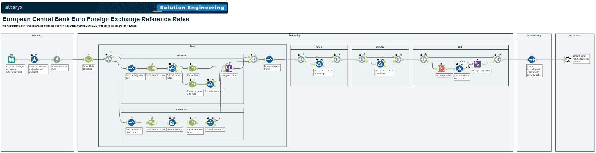
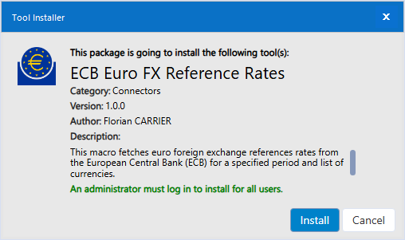
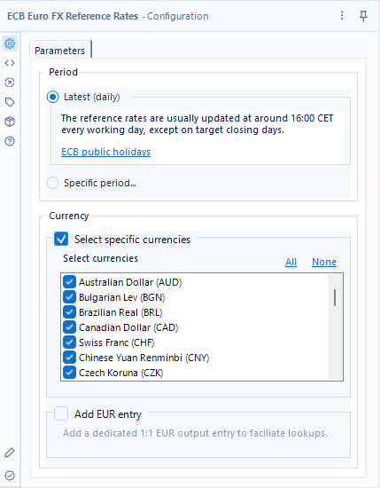

# European Central Bank Euro Foreign Exchange Reference Rates

This macro fetches euro foreign exchange references rates from the [European Central Bank (ECB)](https://www.ecb.europa.eu/stats/policy_and_exchange_rates/euro_reference_exchange_rates/html/index.en.html) for a specified period and list of currencies.

## Installation

A standard Alteryx Tool Installer (.YXI) file is provided. Upon executing the installer, the macro will be setup on the local machine and made available in Alteryx Designer Desktop under the "Connector" tool category.

## Usage

### Configuration

The macro acts as a connector to fetch data from the ECB website and does not require any input.

Three configuration parameters are provided:

1. Period selection (choose one):
   1. Latest (daily)
   2. Specific period (between 2000-07-19 and today)
2. Currency selection (multi-select dropdown):
   1. Australian Dollar (AUD)
   2. Bulgarian Lev (BGN)
   3. Brazilian Real (BRL)
   4. Canadian Dollar (CAD)
   5. Swiss Franc (CHF)
   6. Chinese Yuan Renminbi (CNY)
   7. Czech Koruna (CZK)
   8. Danish Krone (DKK)
   9. British Pound Sterling (GBP)
   10. Hong Kong Dollar (HKD)
   11. Croatian Kuna (HRK)
   12. Hungarian Forint (HUF)
   13. Indonesian Rupiah (IDR)
   14. Israeli New Shekel (ILS)
   15. Indian Rupee (INR)
   16. Icelandic Króna (ISK)
   17. Japanese Yen (JPY)
   18. South Korean Won (KRW)
   19. Mexican Peso (MXN)
   20. Malaysian Ringgit (MYR)
   21. Norwegian Krone (NOK)
   22. New Zealand Dollar (NZD)
   23. Philippine Peso (PHP)
   24. Polish Złoty (PLN)
   25. Romanian Leu (RON)
   26. Swedish Krona (SEK)
   27. Singapore Dollar (SGD)
   28. Thai Baht (THB)
   29. Turkish Lira (TRY)
   30. United States Dollar (USD)
   31. South African Rand (ZAR)
3. *Optional*: EUR 1:1 entry to facilitate lookups.

### Output

The output of the macro is a data table containing the following columns:

1. Date (data type Date): The date of the reference rate.
2. Currency (data type String): The currency code (e.g., USD, GBP).
3. Rate (data type Double): The exchange rate of the currency against the euro.

## Notes

1. The macro relies on the public data from the [ECB website](https://www.ecb.europa.eu/home/html/index.en.html) and is free to use.
2. The reference rates are usually updated at around 16:00 CET every working day, except on [target closing days](https://www.ecb.europa.eu/ecb/contacts/working-hours/html/index.en.html).
